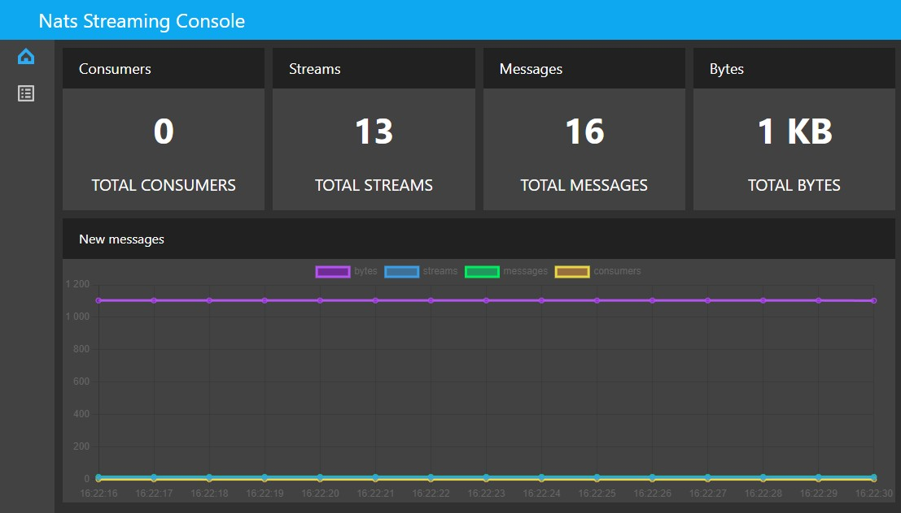
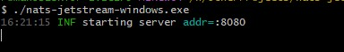
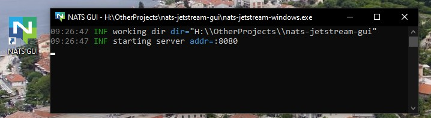

# GUI для nats Jetstream сервера
Позволяет просматривать визуальную статистику, смотреть список стримов, информацию и стримах, читать сообщения, отправлять сообщения.

Внимание: могут быть баги в самом неожиданном месте.

[Скачать](https://github.com/MashinaMashina/nats-jetstream-gui/releases)

Запускать через терминал билд для вашей ОС.

Файл .env-example переименовать в .env и там менять адреса.

Как создать ярлык для запуска:
1. На рабочем столе нажимаем правой кнопкой мыши.
2. Выбираем Создать - Ярлык
3. Указываем команду: `C:\Windows\System32\cmd.exe /k C:\nats-jetstream-gui\nats-jetstream-windows.exe`.
   Где `C:\nats-jetstream-gui\nats-jetstream-windows.exe` - путь до исполняемого файла.
4. Вводим имя `NATS GUI`
5. Сохраняем
6. Жмем правой кнопкой по нашему ярлыку, указываем рабочую папку - папку с исполняемым файлом, в нашем случае `C:\nats-jetstream-gui`.
7. Жмем сменить значок
8. Выбираем значок из папки docs этого репозитория.
9. Применить, сохранить.
10. Готово

